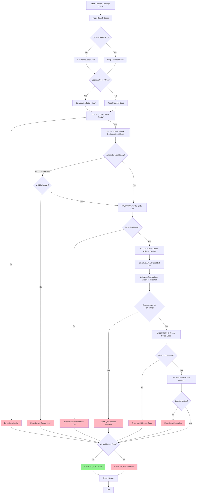

# Credit Shortage Validation Flow

## Process Flow Diagram



## Validation Sequence

### Step-by-Step Breakdown

#### Phase 1: Initialization
1. **Input Receipt**: Receive shortage items in table-valued parameter
2. **Default Application**: Apply default defect code (XP) and location code (WU) where NULL

#### Phase 2: Item Validation
3. **Item Master Check**: 
   - Query `tblItemMaster`
   - Verify item exists
   - **Fail Fast**: If item doesn't exist, mark as invalid

#### Phase 3: Combination Validation
4. **Invoice History Check**:
   - First check `Datawhse.dbo.tblInvoiceDetail`
   - If not found, check `Archive.dbo.tblInvoiceDetail`
   - Validate Customer + Invoice + Serial + Item combination
   - **Fail Fast**: If combination invalid, mark as invalid

#### Phase 4: Quantity Analysis
5. **Order Quantity Retrieval**:
   - Get original ordered quantity from invoice
   - Check both current and archive tables
   - **Fail Fast**: If quantity cannot be determined, mark as invalid

6. **Credit History Check**:
   - Query `tblRetAllowHeader` and `tblRetAllowDetail`
   - Calculate sum of already credited quantities
   - Only count approved credits (`rahAprvDny = 'A'`)
   - Account for allowance percentages

7. **Remaining Calculation**:
   ```
   RemainingCreditableQuantity = OrderedQuantity - AlreadyCreditedQuantity
   ```

8. **Quantity Validation**:
   - Ensure: `ShortageQuantity <= RemainingCreditableQuantity`
   - **Fail Fast**: If exceeded, mark as invalid

#### Phase 5: Code Validation
9. **Defect Code Check**:
   - Query `tblDefectCodes`
   - Verify code exists and is active (`defActive = 'Y'`)
   - **Fail Fast**: If invalid, mark as invalid

10. **Location Code Check**:
    - Query `tblWarehouse`
    - Verify warehouse exists and is active (`whsActive = 'Y'`)
    - **Fail Fast**: If invalid, mark as invalid

#### Phase 6: Results
11. **Final Status**: 
    - `IsValid = 1` if ALL validations pass
    - `IsValid = 0` if ANY validation fails
12. **Error Aggregation**: Concatenate all error messages
13. **Return Results**: Ordered with failures first

---

## Database Interaction Map

```
Input: @ShortageItems
    ↓
┌─────────────────────────────────────────┐
│  #ValidationResults (Temp Table)        │
│  - Holds validation state               │
│  - Updated by each validation step      │
└─────────────────────────────────────────┘
    ↓
┌─────────────────────────────────────────┐
│  VALIDATION 1: tblItemMaster            │
│  - Check item exists                    │
│  - Update: ItemExists flag              │
└─────────────────────────────────────────┘
    ↓
┌─────────────────────────────────────────┐
│  VALIDATION 2: tblInvoiceDetail         │
│  - Current: Datawhse.dbo                │
│  - Archive: Archive.dbo                 │
│  - Update: CustomerSerialItemValid flag │
└─────────────────────────────────────────┘
    ↓
┌─────────────────────────────────────────┐
│  VALIDATION 3: tblInvoiceDetail         │
│  - Get original order quantity          │
│  - Update: OrderedQuantity              │
└─────────────────────────────────────────┘
    ↓
┌─────────────────────────────────────────┐
│  VALIDATION 4: tblRetAllowHeader/Detail │
│  - Calculate credited quantity          │
│  - Update: AlreadyCreditedQuantity      │
│  - Update: RemainingCreditableQuantity  │
└─────────────────────────────────────────┘
    ↓
┌─────────────────────────────────────────┐
│  VALIDATION 5: tblDefectCodes           │
│  - Check defect code active             │
│  - Update: DefectCodeValid flag         │
└─────────────────────────────────────────┘
    ↓
┌─────────────────────────────────────────┐
│  VALIDATION 6: tblWarehouse             │
│  - Check warehouse active               │
│  - Update: LocationCodeValid flag       │
└─────────────────────────────────────────┘
    ↓
Output: Validation Results
```

---

## Error Handling Strategy

### Fail-Fast Approach
- Each validation updates `IsValid` flag
- Errors are accumulated in `ValidationErrors` column
- All validations run (no short-circuit)
- Allows seeing ALL issues in one call

### Error Message Format
```
ERROR: Item [ITEMX] does not exist or is invalid. 
ERROR: Shortage quantity (10) exceeds remaining creditable quantity (5). Already credited: 5. 
ERROR: Defect code [XX] is invalid or inactive.
```

### Success Message Format
```
SUCCESS: All validations passed.
```

---

## Integration Points

### Upstream: IWS Integration
```
IWS API Call
    ↓
Extract Serial#
    ↓
Build Shortage Item
    ↓
Call Validation SP
```

### Downstream: Credit Submission
```
Validation SP Returns Results
    ↓
Filter: IsValid = 1
    ↓
Call usp_CEImportSubmittedCredits
    ↓
Credit Created
```

---

## Performance Optimization

### Index Usage
1. **tblItemMaster**: PK lookup on itmItemnumber
2. **tblInvoiceDetail**: Composite index on (Customer, Invoice, Serial, Item)
3. **tblRetAllowHeader**: Index on (Customer, ApprovalStatus, EnterDate, EnterTime)
4. **tblRetAllowDetail**: Index on (Invoice, Order, Item, EnterDate, EnterTime)

### NOLOCK Strategy
- All SELECT queries use `WITH (NOLOCK)`
- Prevents blocking on high-transaction tables
- Acceptable for validation scenario (eventual consistency)

### Archive Fallback
- Only queries Archive if not found in primary
- Uses `LEFT JOIN` with `NULL` check pattern
- Minimizes unnecessary Archive queries

