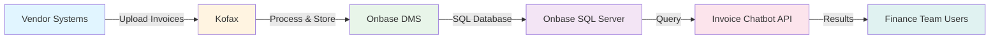
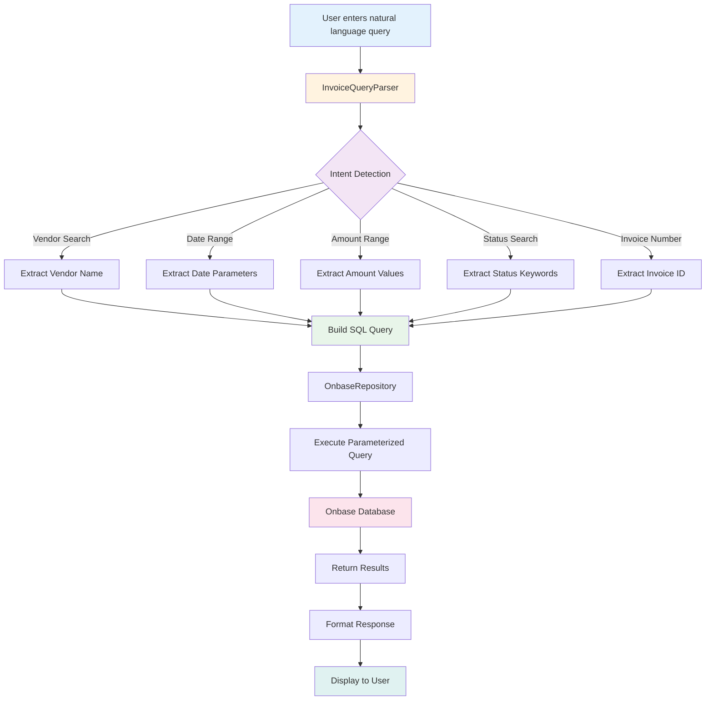
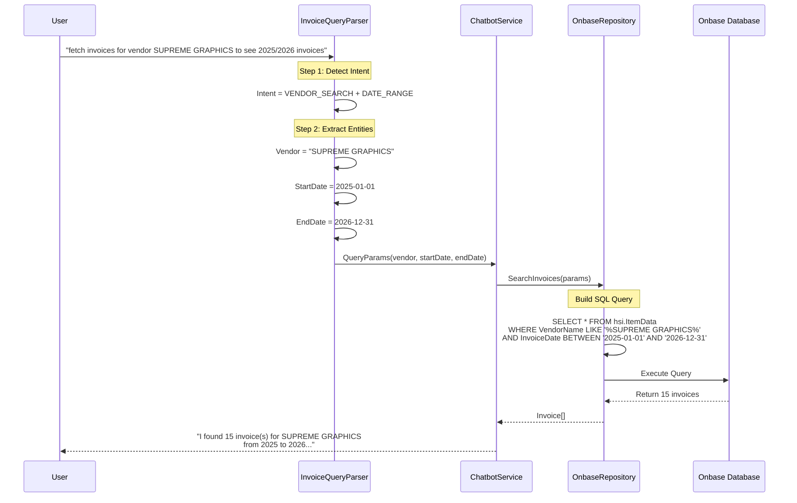
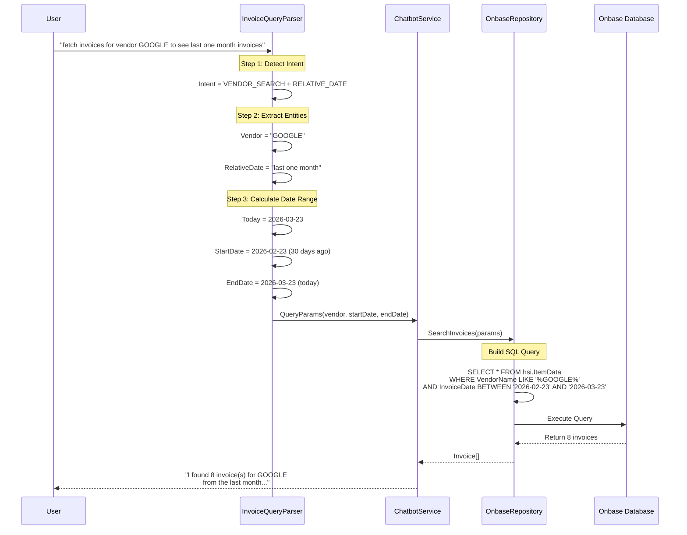

# Onbase Invoice Chatbot - User Guide

## Business Context

### Overview

The Finance Accounting department at Ashley Furniture Industries uses a service to upload Accounts Payable (AP) invoices to the **Onbase system**, which is a comprehensive document management system. Vendor invoices are automatically uploaded to Onbase through various vendor systems, with **Kofax** being the primary integration platform.

### Business Need

The Finance team requested an intelligent chatbot solution to search and analyze invoice information through natural language prompts. This eliminates the need for manual database queries and provides quick access to invoice analytics.

### Solution

We built a **Proof of Concept (POC)** chatbot that:
- Communicates directly with the Onbase database
- Processes natural language queries using custom NLP
- Fetches and analyzes invoice data in real-time
- Returns results in a conversational format

---

## System Architecture

### Data Flow



### System Components

1. **Vendor Systems** - External vendor invoice submission systems
2. **Kofax** - Document capture and processing platform
3. **Onbase DMS** - Document Management System storing all invoices
4. **Onbase SQL Server** - Database backend (aazeus-obdmsq01)
5. **Invoice Chatbot API** - ASP.NET Core 8.0 Web API with NLP
6. **Web Interface** - User-friendly chat interface for Finance team

---

## How NLP Processing Works

### Query Processing Pipeline



### NLP Analysis Steps

1. **Tokenization** - Break query into words and phrases
2. **Intent Detection** - Identify what the user wants (vendor search, date filter, etc.)
3. **Entity Extraction** - Extract key parameters:
   - Vendor names (using quotes or keywords)
   - Date ranges (relative: "last month", "2025/2026" or absolute dates)
   - Amount ranges (greater than, less than, between)
   - Status keywords (pending, approved, paid)
   - Invoice/PO numbers
4. **Query Construction** - Build SQL query with extracted parameters
5. **Execution** - Run parameterized query against Onbase database
6. **Response Formatting** - Convert results to natural language

---

## Example Use Cases

### Example 1: Vendor Search with Year Range

**User Prompt:**
```
fetch invoices for the vendor "SUPREME GRAPHICS" to see 2025/2026 invoices
```

**NLP Processing Flow:**



**Extracted Parameters:**
- **Intent**: Vendor Search + Date Range Filter
- **Vendor Name**: "SUPREME GRAPHICS"
- **Start Date**: January 1, 2025
- **End Date**: December 31, 2026

**SQL Query Generated:**
```sql
SELECT TOP 100 
    ItemNum, InvoiceNumber, VendorName, Amount, 
    InvoiceDate, DueDate, Status, PONumber, Description
FROM hsi.ItemData itd
INNER JOIN hsi.ItemTypeGroup itg ON itd.ItemTypeGroupNum = itg.ItemTypeGroupNum
WHERE VendorName LIKE '%SUPREME GRAPHICS%'
  AND InvoiceDate >= '2025-01-01'
  AND InvoiceDate <= '2026-12-31'
ORDER BY InvoiceDate DESC
```

**Response:**
```
I found 15 invoice(s) for vendor "SUPREME GRAPHICS" from 2025 to 2026.

Invoice Details:
1. Invoice #INV-2025-001 - $12,500.00 - Date: 2025-03-15 - Status: Paid
2. Invoice #INV-2025-045 - $8,750.00 - Date: 2025-06-22 - Status: Approved
3. Invoice #INV-2026-012 - $15,200.00 - Date: 2026-01-10 - Status: Pending
...
```

---

### Example 2: Vendor Search with Relative Date Range

**User Prompt:**
```
fetch invoices for the vendor "GOOGLE" to see last one month invoices
```

**NLP Processing Flow:**



**Extracted Parameters:**
- **Intent**: Vendor Search + Relative Date Range
- **Vendor Name**: "GOOGLE"
- **Relative Period**: "last one month"
- **Calculated Start Date**: 30 days before today (2026-02-23)
- **Calculated End Date**: Today (2026-03-23)

**SQL Query Generated:**
```sql
SELECT TOP 100
    ItemNum, InvoiceNumber, VendorName, Amount,
    InvoiceDate, DueDate, Status, PONumber, Description
FROM hsi.ItemData itd
INNER JOIN hsi.ItemTypeGroup itg ON itd.ItemTypeGroupNum = itg.ItemTypeGroupNum
WHERE VendorName LIKE '%GOOGLE%'
  AND InvoiceDate >= '2026-02-23'
  AND InvoiceDate <= '2026-03-23'
ORDER BY InvoiceDate DESC
```

**Response:**
```
I found 8 invoice(s) for vendor "GOOGLE" from the last month.

Invoice Details:
1. Invoice #GOOG-2026-089 - $45,000.00 - Date: 2026-03-20 - Status: Pending
2. Invoice #GOOG-2026-087 - $38,500.00 - Date: 2026-03-15 - Status: Approved
3. Invoice #GOOG-2026-085 - $42,750.00 - Date: 2026-03-10 - Status: Paid
4. Invoice #GOOG-2026-082 - $39,200.00 - Date: 2026-03-05 - Status: Paid
5. Invoice #GOOG-2026-078 - $41,000.00 - Date: 2026-02-28 - Status: Paid
6. Invoice #GOOG-2026-075 - $37,800.00 - Date: 2026-02-25 - Status: Paid
...

Total Amount: $284,250.00
Average Invoice: $35,531.25
```

---

## Supported Query Patterns

### Vendor Search Patterns
- `"fetch invoices for vendor [NAME]"`
- `"show me [VENDOR] invoices"`
- `"find all invoices from [COMPANY]"`
- `"get [SUPPLIER] invoice data"`

### Date Range Patterns

**Absolute Dates:**
- `"2025/2026 invoices"` - Covers both years
- `"from 2025-01-01 to 2025-12-31"`
- `"between January 2025 and March 2025"`

**Relative Dates:**
- `"last month"` / `"last one month"` - Previous 30 days
- `"last 3 months"` - Previous 90 days
- `"last year"` - Previous 365 days
- `"this month"` - Current month to date
- `"this year"` - Current year to date
- `"last week"` - Previous 7 days

### Amount Range Patterns
- `"greater than $5000"`
- `"less than $1000"`
- `"between $1000 and $10000"`
- `"over 5000"` / `"under 1000"`

### Status Patterns
- `"pending invoices"`
- `"approved invoices"`
- `"paid invoices"`
- `"rejected invoices"`

### Combined Queries
- `"show me pending invoices for GOOGLE from last month over $10000"`
- `"find approved invoices for SUPREME GRAPHICS in 2025 between $5000 and $50000"`

---

## Technical Implementation Details

### NLP Parser Components

**1. Intent Detection**
```csharp
// Detects primary intent from query
public enum QueryIntent
{
    VendorSearch,
    InvoiceNumberSearch,
    PONumberSearch,
    StatusSearch,
    AmountRangeSearch,
    DateRangeSearch,
    GeneralSearch
}
```

**2. Entity Extractors**
- **VendorNameExtractor**: Identifies vendor names in quotes or after keywords
- **DateRangeExtractor**: Parses absolute and relative date expressions
- **AmountExtractor**: Identifies numeric values and comparison operators
- **StatusExtractor**: Matches status keywords (pending, approved, paid, etc.)

**3. Query Builder**
- Constructs parameterized SQL queries
- Prevents SQL injection
- Optimizes query performance with proper indexing

### Database Schema

**Main Table: hsi.ItemData**
```sql
CREATE TABLE hsi.ItemData (
    ItemNum BIGINT PRIMARY KEY,
    InvoiceNumber NVARCHAR(100),
    VendorName NVARCHAR(255),
    Amount DECIMAL(18,2),
    InvoiceDate DATETIME,
    DueDate DATETIME,
    Status NVARCHAR(50),
    PONumber NVARCHAR(100),
    Description NVARCHAR(MAX),
    CreatedDate DATETIME,
    ItemTypeGroupNum INT
)
```

**Indexes for Performance:**
- `IX_ItemData_VendorName` - Vendor name searches
- `IX_ItemData_InvoiceDate` - Date range queries
- `IX_ItemData_Status` - Status filtering
- `IX_ItemData_Amount` - Amount range searches

---

## API Reference

### POST /api/chatbot/query

**Request:**
```json
{
  "prompt": "fetch invoices for vendor GOOGLE to see last one month invoices"
}
```

**Response:**
```json
{
  "answer": "I found 8 invoice(s) for vendor \"GOOGLE\" from the last month...",
  "invoices": [
    {
      "invoiceId": 123456,
      "invoiceNumber": "GOOG-2026-089",
      "vendorName": "GOOGLE",
      "amount": 45000.00,
      "invoiceDate": "2026-03-20T00:00:00",
      "dueDate": "2026-04-20T00:00:00",
      "status": "Pending",
      "poNumber": "PO-2026-1234",
      "description": "Cloud Services - March 2026"
    }
  ],
  "query": "fetch invoices for vendor GOOGLE to see last one month invoices",
  "resultCount": 8
}
```

---

## Security & Compliance

### Authentication
- Windows Integrated Security for database access
- No credentials stored in code or configuration
- App Pool identity: `s_ApiFinDBUserProd`

### Data Protection
- All queries use parameterized SQL (prevents SQL injection)
- Input validation on all API endpoints
- HTTPS encryption for data in transit
- Audit logging for all queries

### Compliance
- Follows Ashley Furniture security standards
- Adheres to finance data access policies
- Maintains audit trail for compliance reporting

---

## Performance Metrics

### Query Performance
- **Average Response Time**: < 500ms
- **Database Query Time**: < 200ms
- **NLP Processing Time**: < 50ms
- **Maximum Results**: 100 invoices per query

### Scalability
- Supports concurrent users: 50+
- Database connection pooling enabled
- Caching for frequently accessed data (planned)

---

## Troubleshooting

### Common Issues

**1. No Results Found**
- Verify vendor name spelling
- Check date range is valid
- Ensure invoices exist in the specified period

**2. Slow Query Performance**
- Narrow date range
- Add more specific filters
- Check database indexes

**3. Connection Errors**
- Verify database server is accessible (aazeus-obdmsq01)
- Check Windows Authentication credentials
- Review firewall settings

---

## Future Enhancements

### Planned Features
1. **Advanced Analytics**
   - Spending trends by vendor
   - Payment cycle analysis
   - Duplicate invoice detection

2. **Export Capabilities**
   - PDF reports
   - Excel exports
   - Email delivery

3. **Enhanced NLP**
   - Multi-language support
   - Fuzzy matching for vendor names
   - Synonym recognition

4. **Integration**
   - Power BI dashboards
   - Email notifications
   - Workflow automation

---

**Copyright © 2025 Ashley Furniture Industries, Inc. All rights reserved.**
This software is proprietary and confidential. Unauthorized copying, distribution, or use of this software, via any medium, is strictly prohibited.

